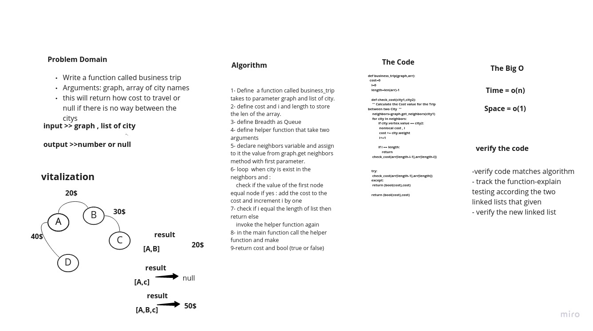

# Challenge: graph business trip

## Summary

Given a business trip itinerary, and an Alaska Airlines route map, is the trip possible with direct flights? If so, how much will the total trip cost be?

## Whiteboard Process



## Approach & Efficiency

+ assures  that there is no edge case that can happen at all
    + Define a counter and a boolean as True, the moment the boolean turns into false, this means that the trip can't be made.
    + get all the nodes, and get the nodes related to the array, then store them inside the new array
    + start a recursive function call, that takes two nodes at a time, determine if there is an edge between them, if exists, it adds the weight to the counter, if it doesn't exist, this will make bool false,
    + return false with $0 cost
    + return the total cost

### Big O:

+ time complexity => O(n).


+ space complexity => O(1).

## Solution

```bash
def check_cost(city1,city2):
     ''' Calculate the Cost value for the Trip between two City  '''
     neighbors=graph.get_neighbors(city1)
     for city in neighbors:
            if city.vertex.value == city2:
             nonlocal cost , i
             cost += city.weight
             i+=1

            if i == length:
                return
     check_cost(arr[length-i-1],arr[length-i])


    try:
     check_cost(arr[length-1],arr[length])
    except:
     return (bool(cost),cost)

    return (bool(cost),cost)
```

## Contributes with:

Abdullah elian and Anas Abughalieh
