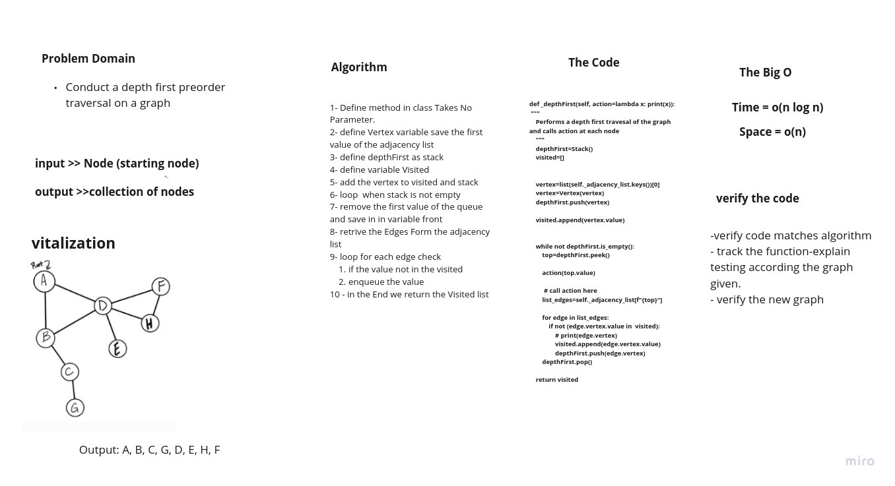

# Challenge Summary

Write the following method for the Graph class:

depth first
Arguments: Node (Starting point of search)
Return: A collection of nodes in their pre-order depth-first traversal order
Display the collection


## Whiteboard Process



## Approach & Efficiency

1- Define  a function called depthFirst takes node as input.
2- check if the node in the graph.
3- define visited empty array
4- declare recursive aas a helper function which takes  node as input
  a- check if the node is not in the visited
         then append that node.
5- invoke the recursive function withe the starting node as input.
 6- return the visited.

### Big O:

Time--> O(n)

space--> O(n)

## Solution

```bash

def _depthFirst(self, action=lambda x: print(x)):
    """
    Performs a depth first travesal of the graph and calls action at each node
    """
    depthFirst=Stack()
    visited=[]


    vertex=list(self._adjacency_list.keys())[0]
    vertex=Vertex(vertex)
    depthFirst.push(vertex)

    visited.append(vertex.value)


    while not depthFirst.is_empty():
        top=depthFirst.peek()

        action(top.value)

         # call action here
        list_edges=self._adjacency_list[f"{top}"]

        for edge in list_edges:
            if not (edge.vertex.value in  visited):
                # print(edge.vertex)
                visited.append(edge.vertex.value)
                depthFirst.push(edge.vertex)
        depthFirst.pop()

    return visited

````
