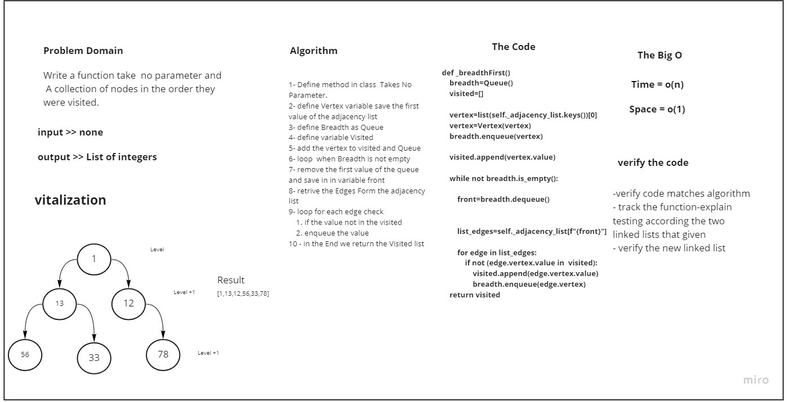

# graph-breadth-first

Implement a breadth-first traversal on a graph.

## Whiteboard Process



## Approach & Efficiency


1- Define method in class  Takes No Parameter.
2- define Vertex variable save the first value of the adjacency list
3- define Breadth as Queue
4- define variable Visited
5- add the vertex to visited and Queue
6- loop  when Breadth is not empty
7- remove the first value of the queue and save in in variable front
8- retrive the Edges Form the adjacency list
9- loop for each edge check
  a- if the value not in the visited
  b- enqueue the value
10 - in the End we return the Visited list

### Big O:

Time = O(n)

Space = O(1)

## Solution

```bash

  def _breadthFirst(self, action=lambda x: print(x)):
    """
    Performs a level order traversal of the graph and calls action at each node
    """


    breadth=Queue()
    visited=[]

    vertex=list(self._adjacency_list.keys())[0]
    vertex=Vertex(vertex)
    breadth.enqueue(vertex)

    visited.append(vertex.value)

    while not breadth.is_empty():

        front=breadth.dequeue()
        # print(front)

        action(front.value)

         # call action here
        list_edges=self._adjacency_list[f"{front}"]

        for edge in list_edges:
            if not (edge.vertex.value in  visited):
                # print(edge.vertex)
                visited.append(edge.vertex.value)
                breadth.enqueue(edge.vertex)
    return visited

```

