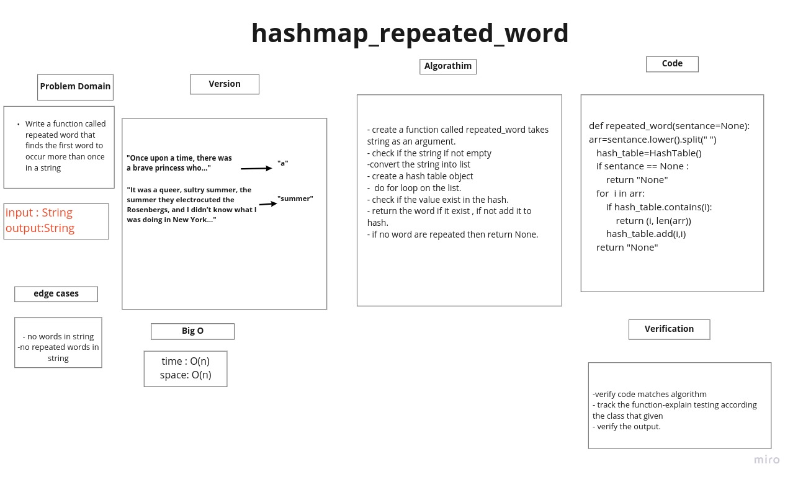

# Challenge Summary

Write a function called repeated word that finds the first word to occur more than once in a string

## Whiteboard Process



## Approach & Efficiency

+ Ceate function take a string with multible words
+ check if the string is empty
+ declear hashtable
+ split all the string to array contain words and chnage it to + + lower case and remove all marks
+ loop along the words fo each word check if the hashtable contarin the word or not if it is return the word else add the word to the hashtable

### Big O:

Time--> O(n)
space--> O(n)

## Solution

```bash
sentance="It was a queer, sultry summer, the summer they electrocuted the Rosenbergs, and I didn’t know what I was doing in New York..."
Expected output = "summer"

def repeated_word(sentance=None):
    arr=sentance.lower().split(" ")
    hash_table=HashTable()
    if sentance == None :
        return "None"
    for  i in arr:
        if hash_table.contains(i):
            return (i, len(arr))
        hash_table.add(i,i)
    return "None"

```
