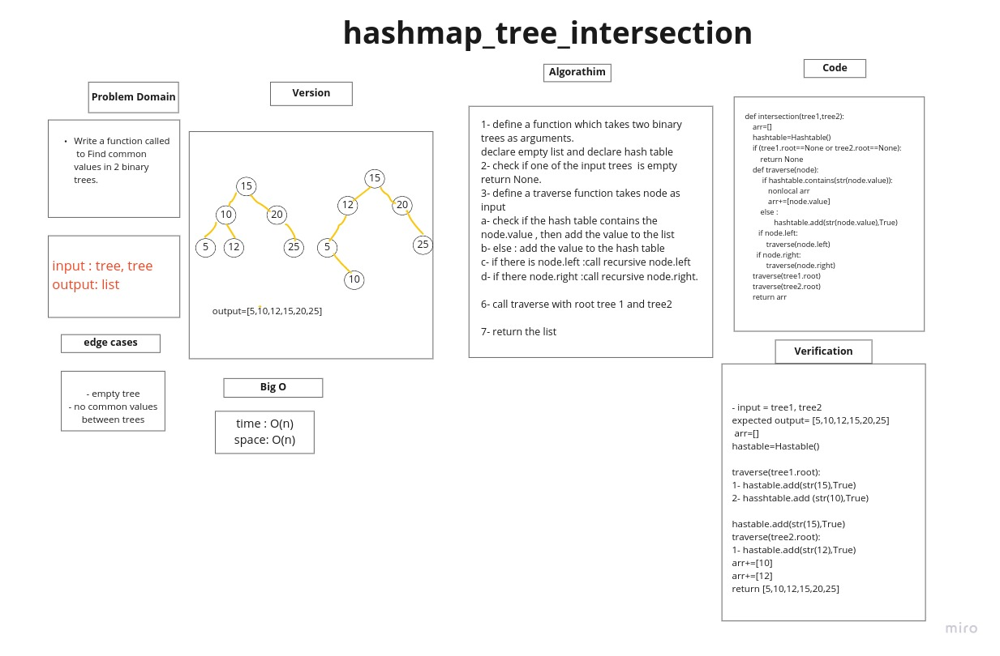

# Challenge Summary

Find common values in 2 binary trees.

## Whiteboard Process



## Approach & Efficiency

I took is traverse over the tree use depth first then append the common values.


+ Ceate function take 2 tree as input
+ declear empty arr
+ decleat hash_table
+ check if the tree is empty ===> return massge
+ declear travrse function take node as input
+ check if the hash_table contains the node.value ===> add the value to the array
+ else: add the value to the hash_table
+ if there is node.left ===> call recursive node.left
+ if there is node.right===> call recursive node.right
+ Call travers with root tree1 and tree2
+ return arr

## Big O:

+ Time o (n)
+ space o(n)

## Solution


```bash
def intersection(tree1,tree2):
    """
    Write a function called tree intersection
    Arguments: two binary trees
    Return: array

    """
    arr=[]
    hashtable=Hash_table(1024)

    if tree1.root==None or tree2.root==None:
        return 'one of the tree is empty'

    def travers(node):
        if hashtable.contains(str(node.value)):
            nonlocal arr
            arr+=[node.value]
        else:
            hashtable.add(str(node.value),True)

        if node.left:
            travers(node.left)
        if node.right:
            travers(node.right)
    travers(tree1.root)
    travers(tree2.root)

    return arr

```
