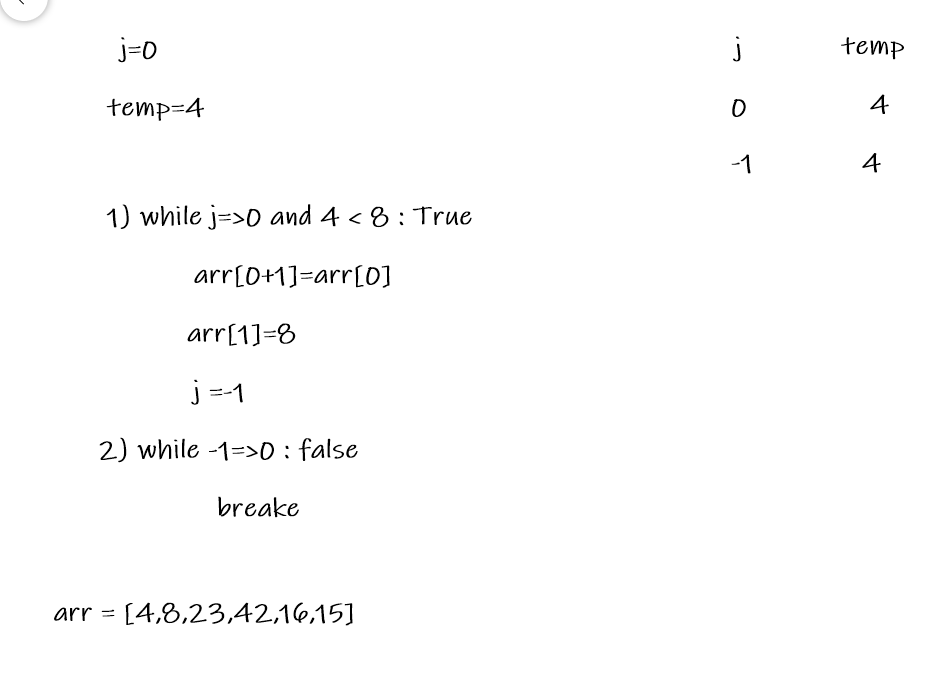
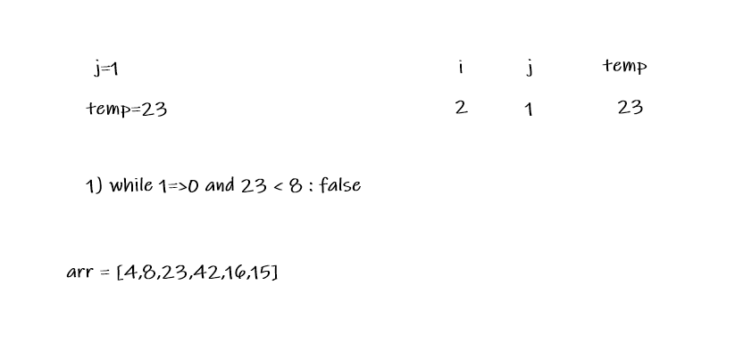
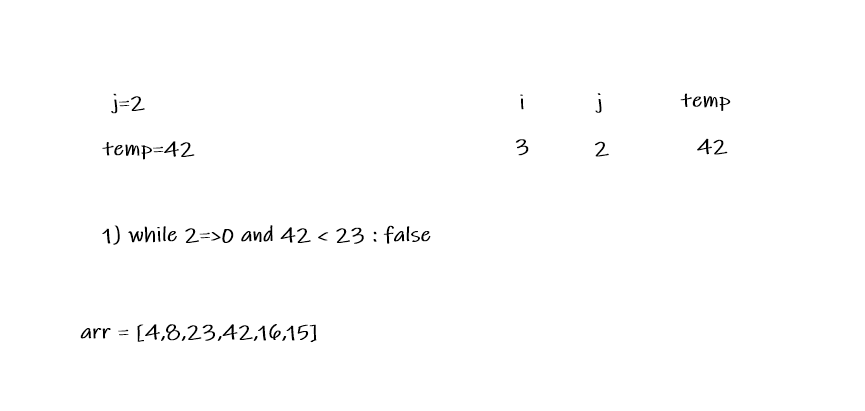
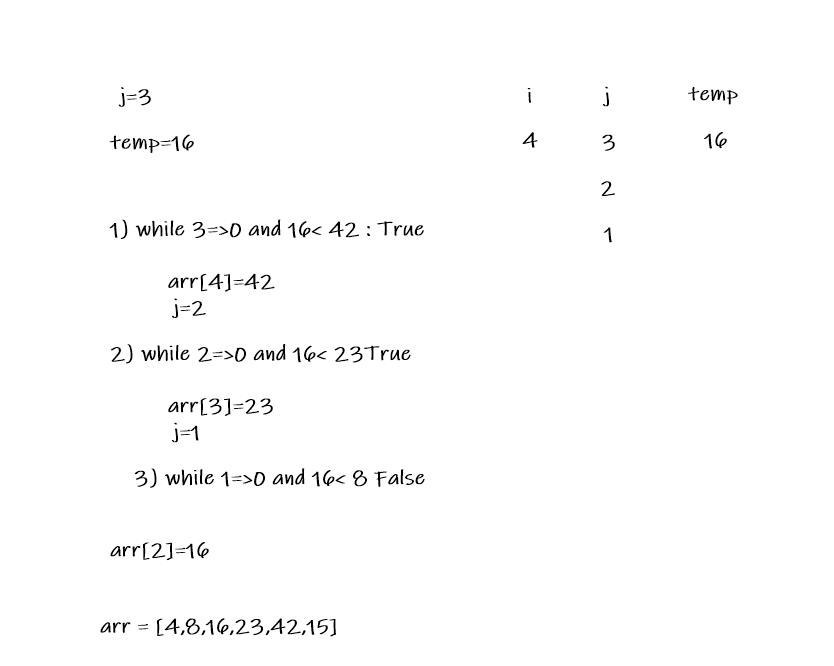

# Insertion sort

Insertion sort is a simple sorting algorithm that builds the final sorted array (or list) one item at a time. It is much less efficient on large lists than more advanced algorithms such as quicksort, heapsort, or merge sort.

# Pseudocode

```
  InsertionSort(int[] arr)

    FOR i = 1 to arr.length

      int j <-- i - 1
      int temp <-- arr[i]

      WHILE j >= 0 AND temp < arr[j]
        arr[j + 1] <-- arr[j]
        j <-- j - 1

      arr[j + 1] <-- temp

```

# Trace

Sample Array: [8,4,23,42,16,15]

## Pass 1:

when i=1



first

# Pass 2:

when i=2


second

## Pass 3:

when i=3



third

## Pass 4:

when i=4


fourth

## Pass 5:

when i=5



fifth

# Efficency

+ Time: O(n^2)
+ Space: O(1)
