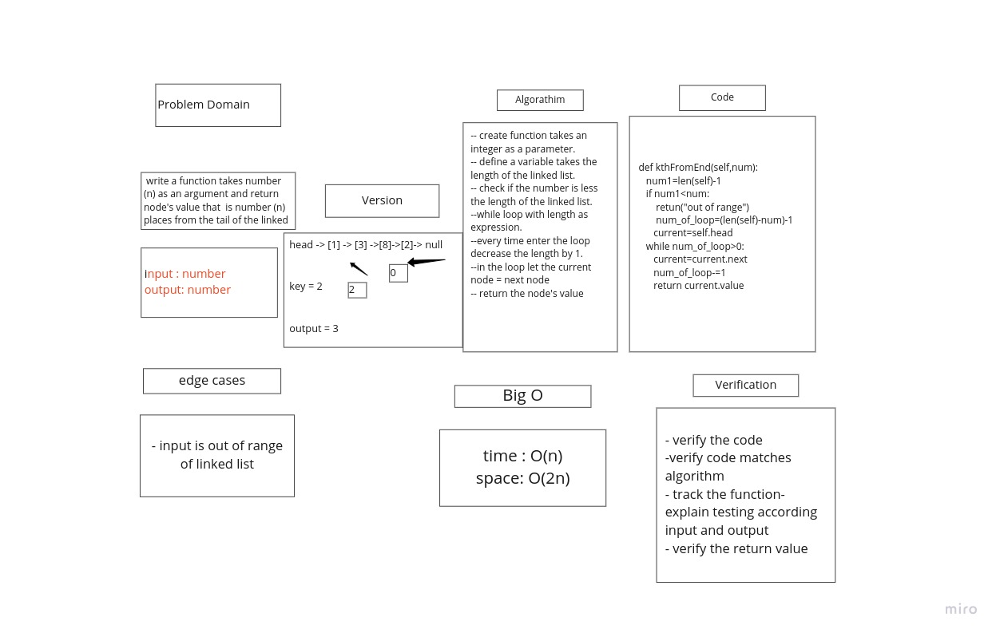

## Linked List Implementation
### Auther :Roaa

### Overview: Create a Node class that has properties for the value stored in the Node, and a pointer to the next Node.

   Create a Linked List class and create function that check value if included in node .

### for linked list insertions
#### append function
arguments: new value
adds a new node with the given value to the end of the list
#### insert before function
arguments: value, new value
adds a new node with the given new value immediately before the first node that has the value specified
####  insert after function
arguments: value, new value
adds a new node with the given new value immediately after the first node that has the value specified

# linked-list-kth
to create a function take a number as an argument and search about node that have the index of this number start from the tail of linked list

## Whiteboard Process
 
