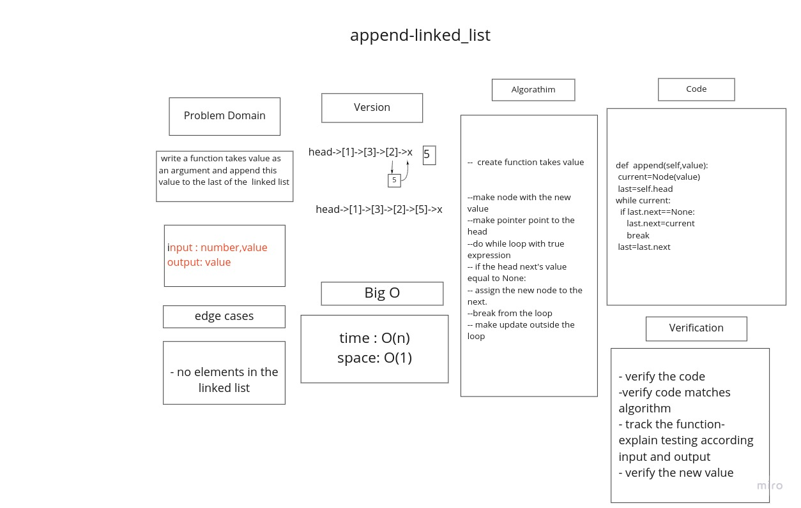
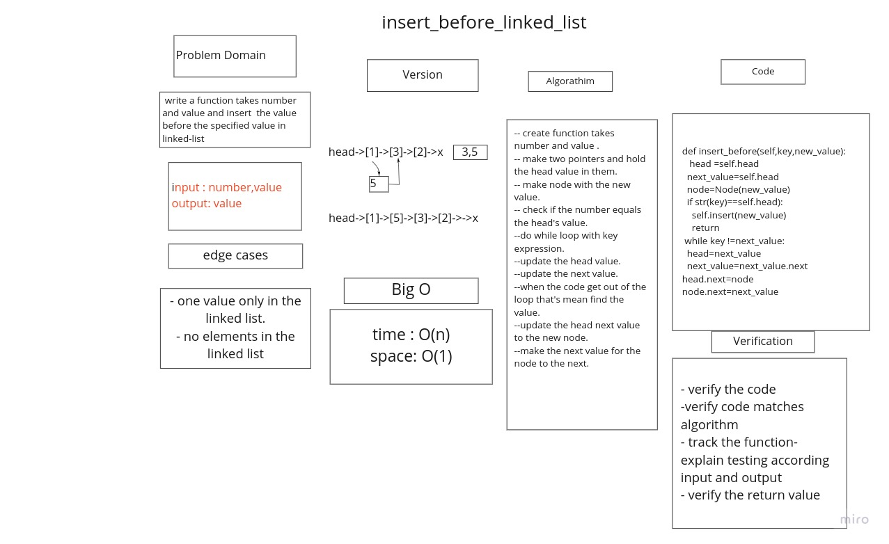
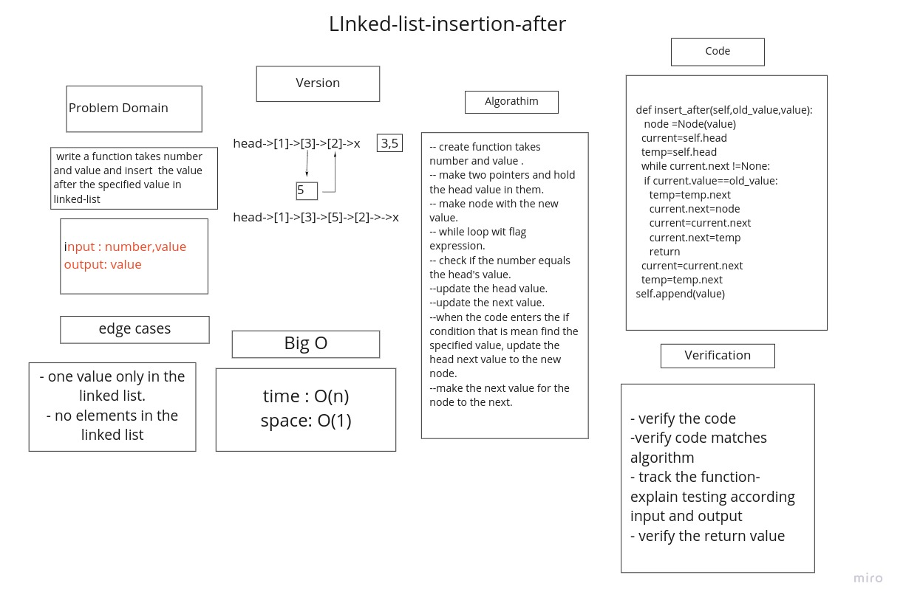
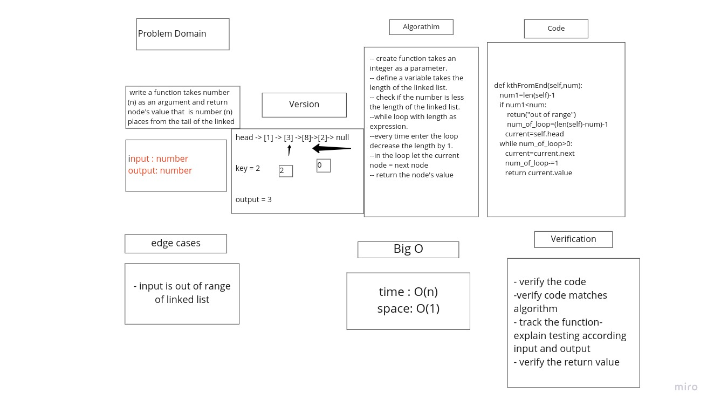

## Linked List Implementation
### Auther :Roaa

### Overview: Create a Node class that has properties for the value stored in the Node, and a pointer to the next Node. Create a Linked List class and create function that check value if included in node .

# Singly Linked List
initiate a linked list and inseris nodes in linked list
## pproach & Efficiency

+ The linked list is alternative to an array-based structure.
+ A linked list is collection of nodes that collectively form linear sequence.
+ In a singly linked list, each node stores a reference to an object that is an element of the sequence, as    well as a reference to the next node of the list.
+ It does not store any pointer or reference to the previous node.
+ To store a single linked list, only the reference or pointer to the first node in that list must be stored. + The last node in a single linked list points to nothing.

### Challenge
+ Create a node class that has properties for the value stored in the Node,
+ and a pointer to the next node class. Within your LinkedList class, include a head property.
+ Upon instantiation, an empty Linked List should be created.
+ and create many methods in the linked list class.

### pproach & Efficiency
**API**

insert function : which take any value as an argument and adds a node of a value to the head of LL with an O(1) Time performance.

includes function : which take any value as an argument and Return T/F if value is in the linked list or not

str function : which dose not take an arguments and returns a string representing all the value in the Linked List.

### for linked list insertions
# append function
arguments: new value
adds a new node with the given value to the end of the list
## Whiteboard Process

# insert before function
arguments: value, new value
adds a new node with the given new value immediately before the first node that has the value specified
## Whiteboard Process

# insert after function
arguments: value, new value
adds a new node with the given new value immediately after the first node that has the value specified

## Whiteboard Process

## Whiteboard Process

### pproach & Efficiency

append function : which takes any value as an argument and add the new node with that value to the end of the list with an O(n) Time performance.

insert_before function : this function will add new value befor spicific place

insert_after function : this function will add new value after spicific place

# linked-list-kth
to create a function take a number as an argument and search about node that have the index of this number start from the tail of linked list

## Whiteboard Process
 

### pproach & Efficiency
for search about node's value from an specified key I used a function that the complexity of time O(n) and space O(1)
