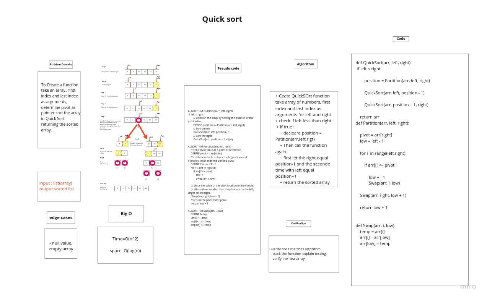

# Challenge Summary

To Create a function take an array , first index and last index as arguments then sort it in Quick Sort returning the sorted array.

## Whiteboard Process



## Approach & Efficiency

+ Ceate QuickSOrt function take array of numbers, first index and last index as arguments for left and right
+ check if left less than right
  + if true :
    + decleare position = Patition(arr,left,rigt)
    + Then call the function again.
    + first let the right equal position-1 and the seconde time with left equal position+1
    + return the sorted array

+ Time complexity : O(n^2)
+ Space complexity: O(log n)

## Solution

```bash

def QuickSort(arr, left, right):
    if left < right:

        position = Partition(arr, left, right)

        QuickSort(arr, left, position - 1)

        QuickSort(arr, position + 1, right)

    return arr
def Partition(arr, left, right):

    pivot = arr[right]
    low = left - 1

    for i  in range(left,right):

        if arr[i] <= pivot :

            low += 1
            Swap(arr, i, low)

    Swap(arr, right, low + 1)

    return low + 1


def Swap(arr, i, low):
    temp = arr[i]
    arr[i] = arr[low]
    arr[low] = temp
```
