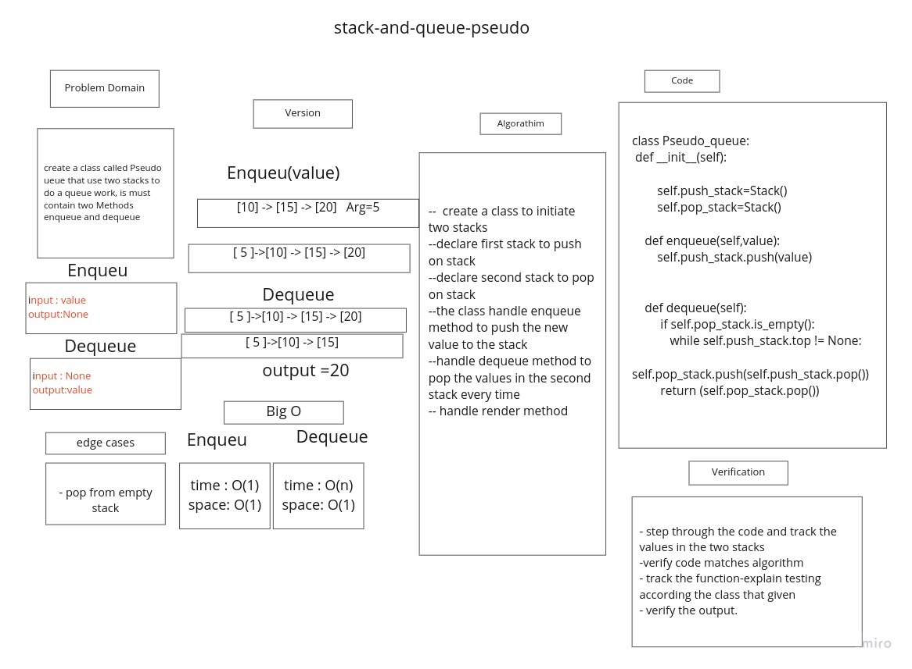
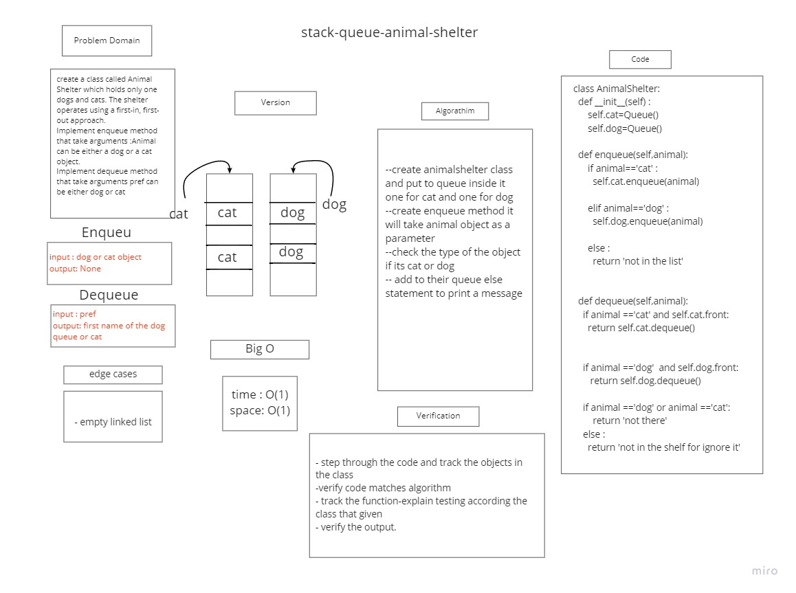

# stack and Queueu

stack is like a container that work as (LIFO) last in first out

queueu is like a container that work as (FIFO) first in first out

## Challenge

Using a Linked List as the underlying data storage mechanism, implement both a Stack and a Queue
Create a Stack class that has a top property. It creates an empty Stack when instantiated.
Create a Queue class that has a front property. It creates an empty Queue when instantiated.

## Approach & Efficiency

+ Implemented both data structures ( stack and  queue) using a basic node class with a next and a value set to none

+ Sstack: I created a class '''Stack()''' and initialized it with self and top properties then do the other methods in the class

+ Queue: I created a class '''Queue()''' and initialized it with self and front and rear properties ten i do the other methods in this class

+ Big O for space and time is O (1)

## API

### Stack

**push:**
Arguments: value
adds a new node with that value to the top of the stack with an O(1) Time performance.
**pop:**
Arguments: none
Returns: the value from node from the top of the stack
Removes the node from the top of the stack
Should raise exception when called on empty stack
**peek:**
Arguments: none
Returns: Value of the node located at the top of the stack
Should raise exception when called on empty stack
**is empty:**
Arguments: none
Returns: Boolean indicating whether or not the stack is empty.

### Queue

**enqueue:**
Arguments: value
adds a new node with that value to the back of the queue with an O(1) Time performance.
**dequeue:**
Arguments: none
Returns: the value from node from the front of the queue
Removes the node from the front of the queue
Should raise exception when called on empty queue
**peek:**
Arguments: none
Returns: Value of the node located at the front of the queue
Should raise exception when called on empty stack
**is empty:**
Arguments: none
Returns: Boolean indicating whether or not the queue is empty

# Stack-queue-pseudo

## Whiteboard Process


## Approach & Efficiency

+ creating a class called PseudoQueue
+ it will use  two stacks as an input, to create a proper front and rear to the Queue.
+ use the complixity of time O(1) and space O(1) for Enqueue
+ use the complixity of time O(n) and space O(n) for Dequeue

## Solution

```
class Pseudo_queue:
    def __init__(self):

        self.push_stack=Stack()
        self.pop_stack=Stack()

    def enqueue(self,value):
        self.push_stack.push(value)


    def dequeue(self):
         if self.pop_stack.is_empty():
            while self.push_stack.top != None:
                self.pop_stack.push(self.push_stack.pop())
         return (self.pop_stack.pop())
```
## stack-queue-animal-shelter
# Challenge Summary
create a class called Animal Shelter which holds only one dogs and cats. The shelter operates using a first-in, first-out approach.
Implement enqueue method that take arguments :Animal can be either a dog or a cat object.
Implement dequeue method that take arguments pref can be either dog or cat

## Whiteboard Process


## Approach & Efficiency
I used enqueue dequeue approach The complixity fot the space O(1) and time O(1)

## Solution
```
class AnimalShelter:
  def __init__(self) :
      self.cat=Queue()
      self.dog=Queue()

  def enqueue(self,animal):
      if animal=='cat' :
        self.cat.enqueue(animal)

      elif animal=='dog' :
        self.dog.enqueue(animal)

      else :
        return 'The animal is not in the list'


  def dequeue(self,animal):
    if animal =='cat' and self.cat.front:
      return self.cat.dequeue()


    if animal =='dog'  and self.dog.front:
       return self.dog.dequeue()

    if animal =='dog' or animal =='cat':
        return 'The animal not there'
    else :
      return 'The animal not in the shelf for ignore it'


```
## Multi-bracket Validation.
# Challenge Summary
write a function called validate brackets takes astring as an argument and return boolean
and check representing weather or not the brackets in the string are balanced

## Whiteboard Process
.jpg)

## Approach & Efficiency
complixity of time O(n) space O(1)

## Solution
```
def validatee_brackets(string):
    open_listt = ["[","{","("]
    close_listt = ["]","}",")"]
    stack = []
    for item in string:
        if item in open_listt:
            stack.append(item)
        elif item in close_listt:
            poss = close_listt.index(item)
            if ((len(stack) > 0) and
                (open_listt[poss] == stack[len(stack)-1])):
                print(open_listt[poss] )
                print(stack[len(stack)-1])
                stack.pop()
            else:
                return False
    if len(stack) == 0:
        return True
    else:
        return False
```
