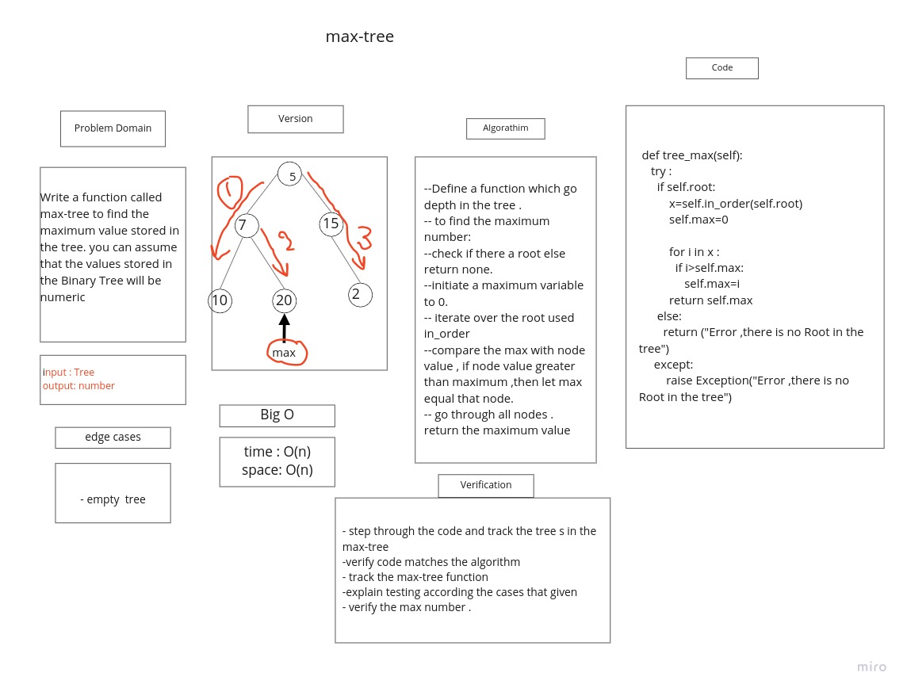

## Trees

Trees Data Structure represent nodes connected by edges.

## Challenge

### Binary Tree and BST Implementation

to build Binary_Tree class Define a method for each of the depth first traversals:

+ pre order
+ in order
+ post order
+ Create a Binary Search Tree class Define methods :

  + Add
  + Contains

## Approach & Efficiency

+ **pre order**: time O(n), space O(n)
+ **in order**: time O(n), space O(n)
+ **post order**: time O(n), space O(n)
+ **Add**: time O(logn), space O(1)
+ **Contains**: time O(logn), space O(1)

## API

+ **pre order**: method that return tree in order < node=> left=> right >
+ **in order**: method that return tree in order < left=> node=> right >
+ **post order**: method that return tree in order < left=> right=> node >
+ **Add**: to add a value to a tree by binary search algorithm
+ **Contains**: to check if the tree contains a value


# Challenge Summary

Write a function called max-tree to find the maximum value stored in the tree. you can assume that the values stored in the Binary Tree will be numeric.

## Whiteboard Process



## Approach & Efficiency

I iterate over the tree using in-order method for that approach The complixity of the max-tree method:
 time is O(n) and for space O(n)
 because the  **in order** method : time O(n), space O(n)

## Solution

```
def tree_max(self):
     try :
      if self.root:
       temp_value=self.in_order(self.root)
       self.max=0

       for num in temp_value :
        if num>self.max:
            self.max=num
       return self.max
      else:
        return ("Error ,there is no Root in the tree")
     except:
         raise Exception("Error ,there is no Root in the tree")
```
