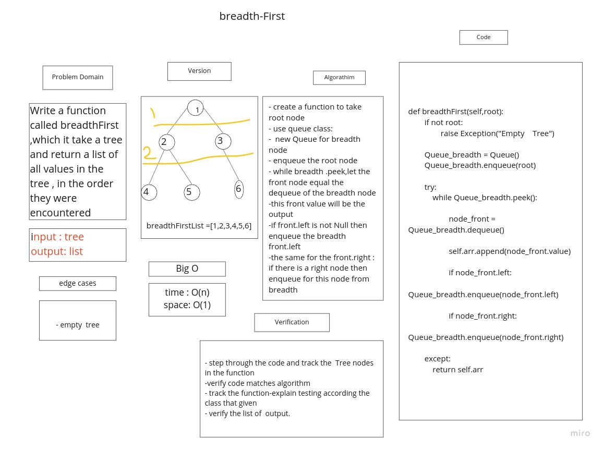
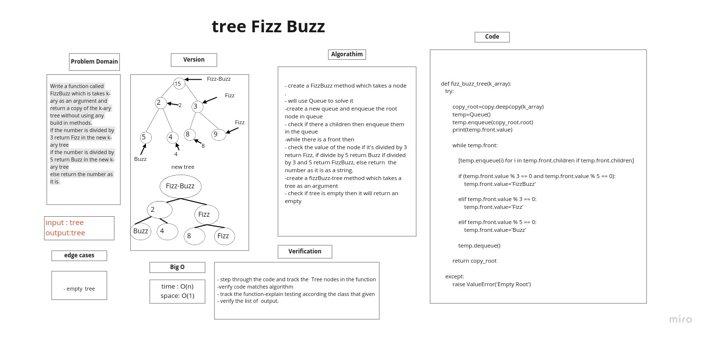

## Trees

Trees Data Structure represent nodes connected by edges.

## Challenge

### Binary Tree and BST Implementation

to build Binary_Tree class Define a method for each of the depth first traversals:

+ pre order
+ in order
+ post order
+ Create a Binary Search Tree class Define methods :

  + Add
  + Contains

## Approach & Efficiency

+ **pre order**: time O(n), space O(n)
+ **in order**: time O(n), space O(n)
+ **post order**: time O(n), space O(n)
+ **Add**: time O(logn), space O(1)
+ **Contains**: time O(logn), space O(1)

## API

+ **pre order**: method that return tree in order < node=> left=> right >
+ **in order**: method that return tree in order < left=> node=> right >
+ **post order**: method that return tree in order < left=> right=> node >
+ **Add**: to add a value to a tree by binary search algorithm
+ **Contains**: to check if the tree contains a value


# Challenge Summary

Write a function called max-tree to find the maximum value stored in the tree. you can assume that the values stored in the Binary Tree will be numeric.

## Whiteboard Process


## Approach & Efficiency

I iterate over the tree using in-order method for that approach The complixity of the max-tree method:
 time is O(n) and for space O(n)
 because the  **in order** method : time O(n), space O(n)

## Solution

```
def tree_max(self):
     try :
      if self.root:
       temp_value=self.in_order(self.root)
       self.max=0

       for num in temp_value :
        if num>self.max:
            self.max=num
       return self.max
      else:
        return ("Error ,there is no Root in the tree")
     except:
         raise Exception("Error ,there is no Root in the tree")
```
<!-- ////////////////////////////////////////////////////////////////////// -->
# Breadth First

Write a function called breadth first that accept the root of the tree and return the values in array

## Whiteboard Process



## Approach & Efficiency

I used the queue data structure to implement the breadthFirst order as it shown in the Solution bellow and the  Time Complixity for it O(n) the space Complixity is O (1)

## Solution

```
 def breadthFirst():

        if not root:
                raise Exception("Empty Tree")

        Queue_breadth = Queue()
        Queue_breadth.enqueue(root)

        try:
            while Queue_breadth.peek():

                    node_front = Queue_breadth.dequeue()

                    self.arr.append(node_front.value)

                    if node_front.left:
                        Queue_breadth.enqueue(node_front.left)

                    if node_front.right:
                        Queue_breadth.enqueue(node_front.right)

        except:
            return self.arr


```
<!-- ////////////////////////////////////////////////////////////////////// -->
# Tree-FizzBuzz

To Write a function called fizz buzz tree Arguments: k-ary tree Return:

+ The new k-ary tree Determine whether or not the value of each node is divisible by 3, 5 or both.

+ Create a new tree with the same structure as the original, but the values modified as follows:

+ If the value is divisible by 3, replace the value with “Fizz” If the value is divisible by 5, replace the value with “Buzz” If the value is divisible by 3 and 5, replace the value with “FizzBuzz” If the value is not divisible by 3 or 5, simply turn the number into a String.

## Whiteboard Process



## Approach & Efficiency

I used Queue to restore the nodes of the k-ary tree and dequeue them to the new k-ary tree, For that problem the complixity of time is O(n) and the complixity of space is O(1)


## Solution

```
def fizz_buzz_tree(k_array):
   try:

        copy_root=copy.deepcopy(k_array)
        temp=Queue()
        temp.enqueue(copy_root.root)

        while temp.front:

            [temp.enqueue(i) for i in temp.front.children if temp.front.children]

            if (temp.front.value % 3 == 0 and temp.front.value % 5 == 0):
                temp.front.value='FizzBuzz'

            elif temp.front.value % 3 == 0:
                temp.front.value='Fizz'

            elif temp.front.value % 5 == 0:
                temp.front.value='Buzz'

            temp.dequeue()

        return copy_root

   except:
        raise ValueError('Empty Root')


```
